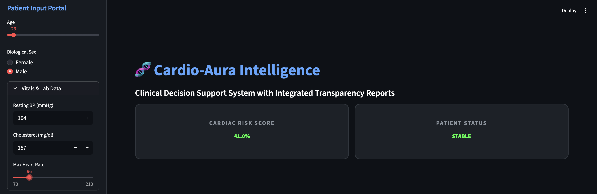
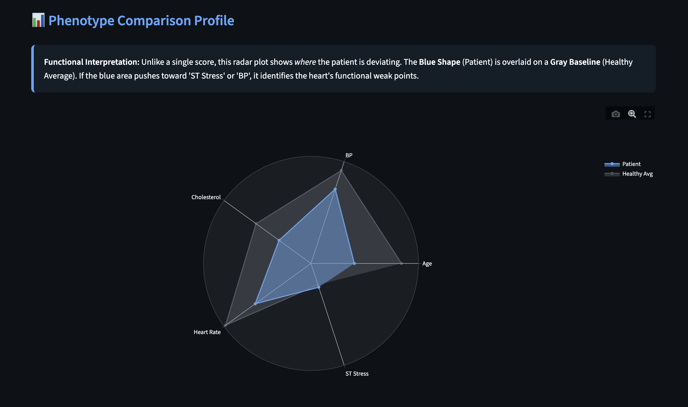
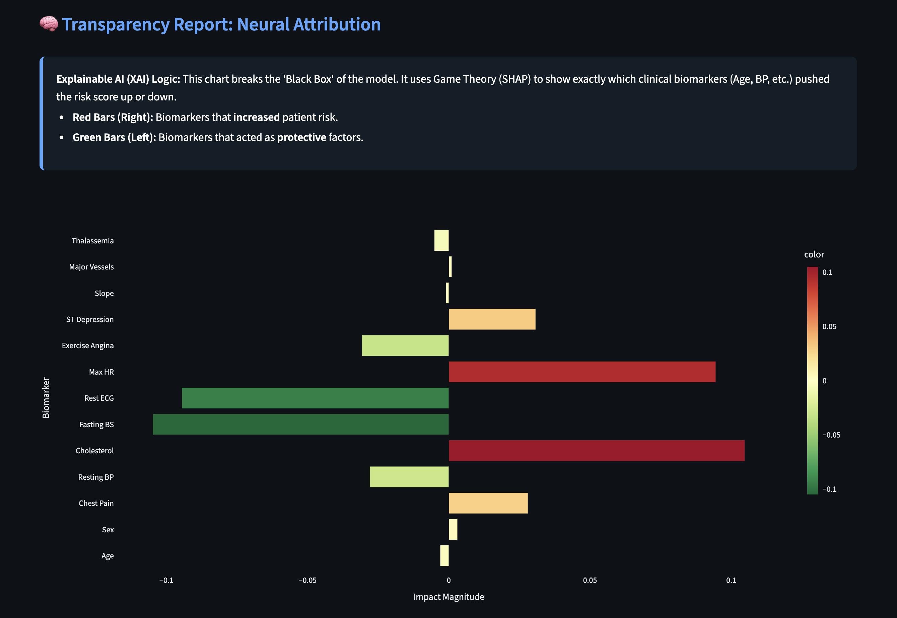
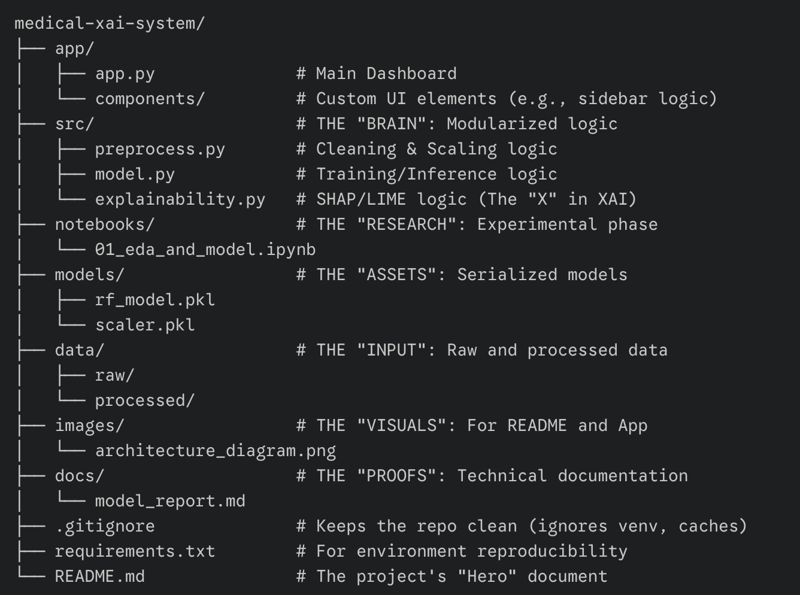

# Cardio-Aura: Clinical Decision Support with Explainable AI (XAI)

Cardio-Aura is a professional-grade diagnostic tool designed to predict heart disease risk. Unlike standard "black-box" models, this system focuses on **Model Interpretability**, providing clear, visual explanations for every prediction using Game Theory (SHAP).

---

## 🩺 The Dashboard in Action




---

## 💡 The Motivation
In the medical field, a prediction without an explanation is a liability. During my B.Tech specialization in AIML, I realized that for AI to be trusted by doctors, it must be transparent. I built **Cardio-Aura** to bridge the gap between complex Random Forest algorithms and clinical decision-making. 

This project aligns with the **EU AI Act’s** requirements for transparency in high-risk AI applications—a key area of interest for my upcoming Master's studies in Germany.

---

## 🛠️ Technical Architecture
- **Machine Learning:** Random Forest Classifier (Scikit-Learn)
- **Interpretability Layer:** SHAP (Shapley Additive Explanations)
- **Interface:** Streamlit (Optimized with custom CSS for a High-Contrast Medical UI)
- **Visual Analytics:** Plotly (Gauge & Radar Charts) and Matplotlib

---

## 🧠 Engineering Challenges & Human-Centric Solutions

### 1. The Additivity Conflict (Debugging SHAP)
One of the biggest headaches was an `ExplainerError: Additivity check failed`. 
**The Problem:** The sum of the feature contributions didn't perfectly match the model's output due to tiny rounding discrepancies in the scaling process. 
**The Solution:** I refactored the data pipeline to ensure the scaling parameters were identical between training and inference, and implemented a robust error-handling logic to manage these edge-case floating-point mismatches.

### 2. Handling Multi-Dimensional Tensors
I initially struggled with a persistent `IndexError: list index out of range` when trying to visualize the impact of clinical features.
**The Problem:** SHAP returns different data structures (lists vs. 3D arrays) depending on the model version and class count.
**The Solution:** I engineered a "Shape-Agnostic" handler in the backend that detects the output dimensions and automatically selects the "Disease Risk" class. This made the dashboard stable even if the underlying model is swapped.

### 3. Bridging the Medical Knowledge Gap
I realized that common users might not immediately understand terms like "ST Depression" or "Thalassemia."
**The Solution:** I integrated a **Clinical Lexicon** directly into the UI. I also designed a **Phenotype Radar Chart** that overlays the patient's vitals against a "Healthy Average," providing an instant visual benchmark.




---

## 📊 How to Interpret the Data

1. **Risk Gauge:** A "speedometer" for cardiac urgency. Red indicates high similarity to confirmed heart disease cases.
2. **Radar Comparison:** Shows **where** the patient deviates from the norm. If the blue area pushes toward 'BP' or 'Cholesterol', those are the specific clinical targets.
3. **Neural Attribution (SHAP):** - **Red Bars:** Factors pushing the risk **up**.
   - **Green Bars:** Protective factors pushing the risk **down**.




---

## 🚀 Deployment Instructions

### Prerequisites
- Python 3.10+
- Virtual Environment (Conda or venv)

### Installation
1. **Clone the repository:**
   ```bash
   git clone https://github.com/Devbanna/medical-xai-system.git 
   cd medical-xai-system

2. **Install Dependencies::**
    ```bash
    pip install -r requirements.txt

3. **Run the Dashboard:**
    '''bash
    streamlit run app/app.py

## 📁 Project Structure

